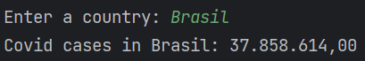
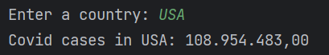
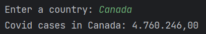
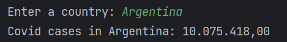
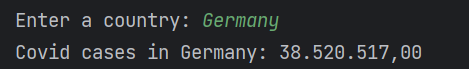
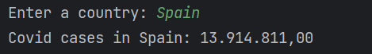
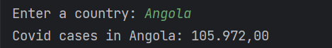
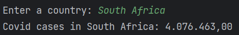
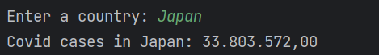
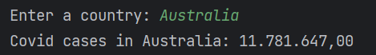

# CovidCases 🦠

## About the project📜
Python project that consumes the API of coronavirus cases in all countries from 'disease.sh' and, through clean and simple code, shows the number of covid cases in the country chosen by the user

## Technologies used 💻⚙️
- PyCharm
- Python

## Examples

 
  
  
  
  
  
  
  
  
  
  
  
  

